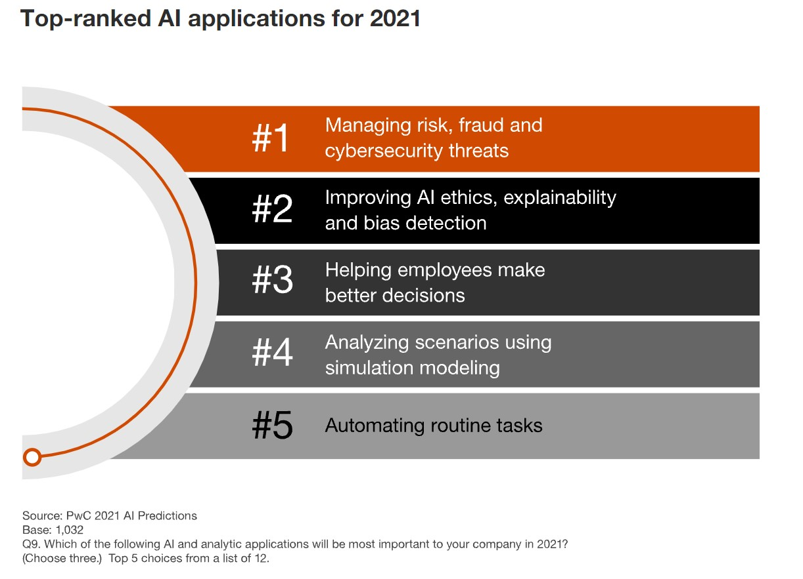
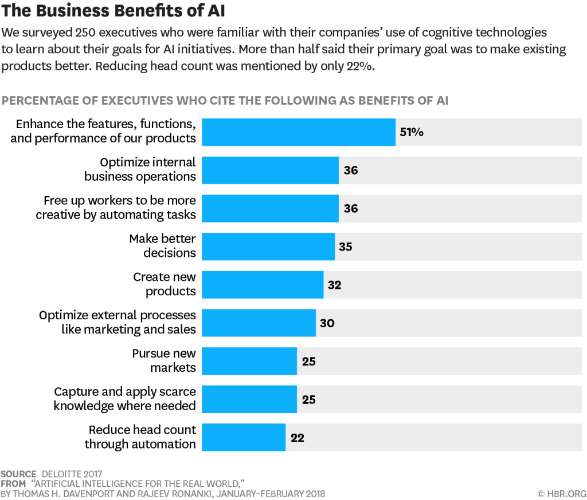
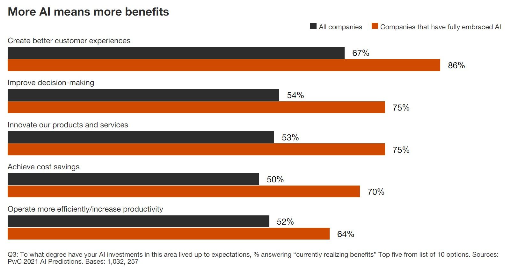
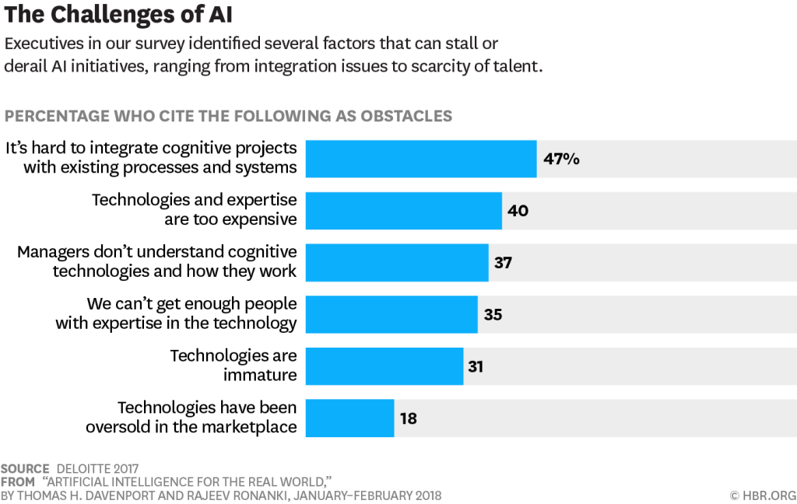
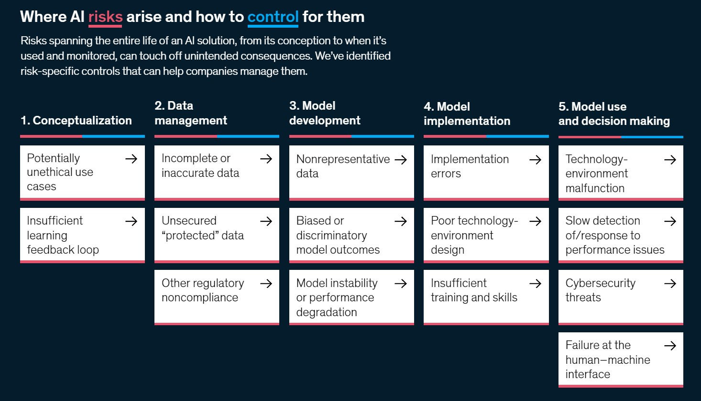
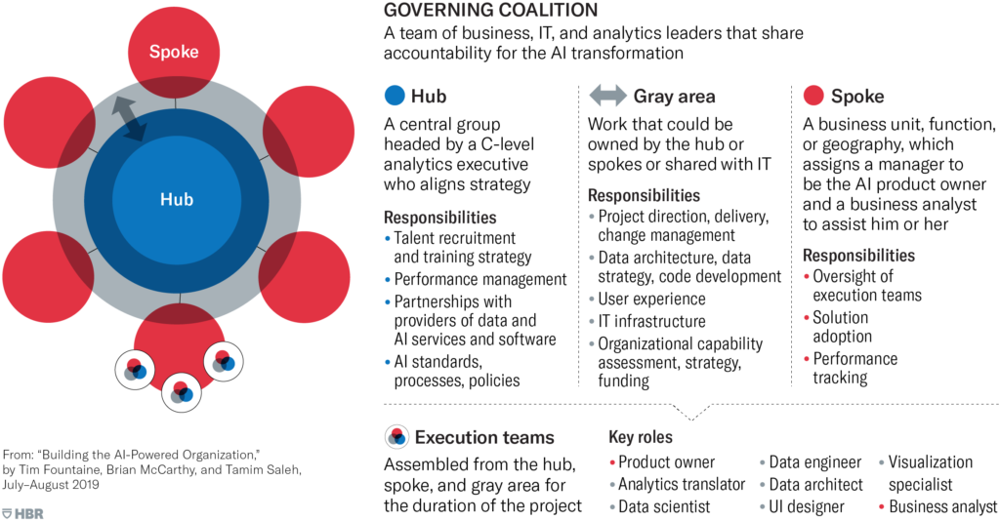

# The Opening

```{r setup, include=FALSE}
knitr::opts_chunk$set(echo = TRUE)
```

Today, we are going to talk about the role of Artificial Intelligence in businesses nowadays. What should we think when we mention AI in a corporate or a start-up? How did AI-powered solutions evolve to this day? What do they now offer in business problems? What are the challenges companies face? How should the stakeholders expect from AI projects and AI-powered products? These are the main questions we are going to highlight and clarify.

Some facts before the start:

-   "The results of this year's McKinsey Global Survey on artificial intelligence (AI) suggest that organizations are using AI as a tool for generating value. Increasingly, that value is coming in the form of revenues. A small contingent of respondents coming from a variety of industries attribute 20 percent or more of their organizations' earnings before interest and taxes (EBIT) to AI. These companies plan to invest even more in AI in response to the COVID-19 pandemic and its acceleration of all things digital." [@mckinsey-global]

-   "50% of respondents report that their companies have adopted AI in at least one business function" [@mckinsey-global]

- "The business functions in which organizations adopt AI remain largely unchanged from the 2019 survey, with service operations, product or service development, and marketing and sales again taking the top spots." [@mckinsey-global]

- "the largest shares of respondents report revenue increases for inventory and parts optimization, pricing and promotion, customer-service analytics, and sales and demand forecasting" [@mckinsey-global]

- "The use cases that most commonly led to cost decreases are optimization of talent management, contact-center automation, and warehouse automation." [@mckinsey-global]

- "Just 16 percent of respondents say their companies have taken deep learning beyond the piloting stage. Once again, high-tech and telecom companies are leading the charge, with 30 percent of respondents from those sectors saying their companies have embedded deep-learning capabilities." [@mckinsey-global]

- "Generally, respondents from companies that have adopted more AI capabilities are more likely to report seeing AI models misperform amid the COVID-19 pandemic than others are." [@mckinsey-global]

\newpage

# AI Meaning Before & Today

*What did AI mean to companies before, and what does today?*

The history of AI as a scientific discipline dates back to the 50s [@Unesco]. What were the solutions back then, and how is it now with the current technologies?

Most people use AI with Machine Learning interchangeably; however, simple process automation is also under the category of AI in business terminology. @hbr-realworld frame AI under three categories: process automation (RPA), cognitive insight (insights from data), cognitive engagement (employees and customers).

```{r aiapplications, echo=FALSE, fig.align='center', fig.cap="PWC Predictions 2021 - Top AI Applications", out.width = '80%'}

```

\newpage

# Problems in Businesses to solve with AI

*What are the problems in businesses in which current AI technologies have the potential to solve?*

```{r hbr-aibenefits, echo=FALSE, fig.align='center', fig.cap="Benefits of AI HBR Survey Result", out.width = '60%'}

```


"Information-intensive domains such as marketing, health care, financial services, education, and professional services could become simultaneously more valuable and less expensive to society." [@hbr-realworld]

"Repeated tasks will probably be fully automatized or powered with AI to ease the work of the supervisors. "Cognitive technologies are also a catalyst for making other data-intensive technologies succeed, including autonomous vehicles, the Internet of Things, and mobile and multichannel consumer technologies." [@hbr-realworld]

"AI is paying off in concrete ways, with benefits ranging from revenue growth to better decision-making and improved customer experience. In fact, the companies in our survey that have rolled out AI enterprise-wide are more optimistic about growth despite the pandemic: 25% expect to increase revenue, compared with 18% for all companies." [@pwc-predictions]

```{r pwc-aibenefits, echo=FALSE, fig.align='center', fig.cap="PWC Predictions 2021 - AI Benefits to Respondents", out.width = '80%'}

```

\newpage

# Challenges in Businesses with AI

*What are the challenges in businesses integrating AI into their operations?*

```{r challenges, echo=FALSE, fig.align='center', fig.cap="Challenges of AI HBR Survey Result", out.width = '60%'}

```

@hbr-realworld give a four-step framework for integrating AI:

1. Understanding The Technology:

-   Black-box models are problematic to interpret and disadvantageous over transparent rule-based expert models.

-   Understanding different technologies are key to choose the correct method for specific company needs.

-   Employees willing to learn and integrate are critical: "some will leap at the opportunities, while others will want to stick with tools they're familiar with."

-   Out-source is a sound option when the projects are short-term.

-   "Given the scarcity of cognitive technology talent, most organizations should establish a pool of resources---perhaps in a centralized function such as IT or strategy---and make experts available to high-priority projects throughout the organization."

2. Creating a Portfolio of Projects

-   Identifying the opportunities:

    -   *Bottlenecks*: knowledge exists in the organization, but it is not optimally distributed (healthcare example).

    -   *Scaling challenges*: knowledge exists, but the process for using it takes too long or is expensive to scale.

    -   *Inadequate firepower*: there are terabytes of data but no human or computer resources to process.

-   Determining the use cases: Do we really need it? Which specific case do we have? Does it make sense competitively?

-   Selecting the technology Does the technology mature enough to solve my problem? "It's wiser to take incremental steps with the currently available technology while planning for transformational change in the not-too-distant future."

3. Launching Pilots

"Proof-of-concepts pilots are particularly suited to initiatives that have high potential business value or allow the organization to test different technologies at the same time."

-   Business-process Design "Systematic redesign of workflows is necessary to ensure that humans and machines augment each other's strengths and compensate for weaknesses." The company can't exploit full of the advantage by automatizing all workflows.

4.  Scaling Up

Is the pilot project feasible for scaling up? The company needs a solid plan and collaboration between technology experts and owners of the business process being automatized. A successful pilot project does not always guarantee to be effective at a large scale and possible to implement.

@mckinsey-risk elaborate on the risks of AI for businesses. They  categorize the risks under the five: data difficulties, technology troubles, security snags, algorithms, and human-machine interactions.

```{r airisks, echo=FALSE, fig.align='center', fig.cap="AI Risk Roots", out.width = '90%'}

```

"respondents at high performers are 2.6 times more likely than others to say their organizations are managing equity and fairness risks such as unwanted bias in AI-driven decisions." [@mckinsey-global]

"A lack of model explainability presents a level of risk in nearly every industry. In some areas, like healthcare, the stakes are particularly high when AI could be presenting a recommendation for patient care. In financial services, regulators may need to know why an organization is making particular decisions—on lending, for example. But explainability can present another risk: lack of AI adoption, leading to wasted investment and the risk of falling behind the competition." [@mckinsey-global]

\newpage

# Guideline to Managers

*What should business managers expect from an AI project? Which points are to consider?*

@hbr-buildingai highlights the challenge of changing the company's culture rather than the technological capabilities. Most of the projects are stuck at ad-hoc pilots, and transitions are too slow because of cultural and organizational barriers.

"One of the biggest mistakes leaders make is to view AI as a plug-and-play technology with immediate returns." [@hbr-buildingai] "While cutting-edge technology and talent are certainly needed, it's equally important to align a company's culture, structure, and ways of working to support broad AI adoption." [@hbr-buildingai]

To scale up AI, companies must make three shifts:

-   From siloed work to interdisciplinary collaboration (take the full workflow into consideration)

-   From experience-based, leader-driven decision making to data-driven decision making at the front line (invest in education and adoption)

-   From rigid and risk-averse to agile, experimental, and adaptable (normalize failure) Leaders need to tell a compelling story to employees to convince them AI will assist their job rather than taking it. "Our research shows that the majority of workers will need to adapt to using AI rather than be replaced by AI." [@hbr-buildingai] A relationship manager who thinks AI can't substitute humans in understanding the customer may also hamper the processes.

"In other cases, siloed processes can inhibit the broad adoption of AI. Organizations that assign budgets by function or business unit may struggle to assemble interdisciplinary agile teams, for example." [@hbr-buildingai] Budgeting at least as much for integration and adoption as for technology is crucial. "90% of the companies that had engaged in successful scaling practices had spent more than half of their analytics budgets on activities that drove adoption, such as workflow design, communication, and training."

"Organizations needn't focus solely on quick wins; they should develop a portfolio of initiatives with different time horizons. Automated processes that don't need human intervention, such as AI-assisted fraud detection, can deliver a return in months, while projects that require human involvement, such as AI-supported customer service, are likely to pay off over a longer period."


```{r organizingai, echo=FALSE, fig.align='center', fig.cap="Organization Scheme for Managing AI Tasks", out.width = '60%'}

```

“AI-enabled companies divide key roles between a hub and spokes. A few tasks are always owned by the hub, and the spokes always own execution. The rest of the work falls into a gray area, and a firm’s individual characteristics determine where it should be done.”

The allocation of tasks depends on three factors: (1) the maturity of AI capabilities [more mature to the spoke], (2) business model complexity [more complex to the hub], (3) the pace and level of technical innovation required [to the gray area when more pace needed].


According to @mckinsey-global, respondents at AI high performers are better in overall performance, leadership, and resource commitment to AI. "High performers also tend to have the ability to develop AI solutions in-house—as opposed to purchasing solutions—and they typically employ more AI-related talent, such as data engineers, data architects, and translators, than do their counterparts." [@mckinsey-global] Six set of practices differentiate high-performing companies from others: strategy, talent and leadership, ways of working, model tools and technology, data, adoption. (Detailed in [@mckinsey-global])

\newpage

# Guideline to Employees

*What should employees expect from an AI project? How should they direct the project and the expectations?*

\newpage

# Guideline to Customers

*What should customers (B2B or B2C) expect from AI-powered products?*

\newpage

# Resources
